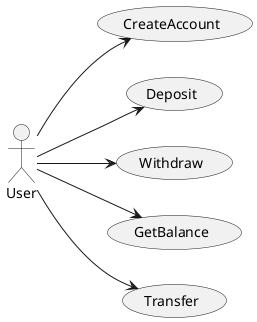
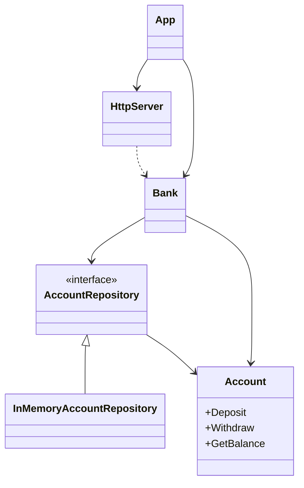

Bank app

## Description
This is a simple bank app that allows users to create accounts, deposit and withdraw money, and check their balance.
It can be accessed via HTTP API and follows Hexagonal Architecture.


### Use Cases


### Design



### API

- [POST /accounts](#create-account)
- [POST /accounts/:id/deposit](#deposit)
- [POST /accounts/:id/withdraw](#withdraw)
- [GET /accounts/:id](#get-balance)
- [POST /accounts/:id/transfer](#transfer)

#### Create Account
```
POST /accounts

Request: 
{
    "name": "John Doe"
}

Response:
200 OK
{
    "id": "1",
}
```

#### Deposit
```
POST /accounts/1/deposit

Request:
{
    "amount": 100
}

Response:
200 OK
{
    "id": "1",
    "balance": 100
}
```

#### Withdraw
```
POST /accounts/1/withdraw

Request:
{
    "amount": 50
}

Response:
200 OK
{
    "id": "1",
    "balance": 50
}
```

#### Get Balance
```
GET /accounts/1

Response:
200 OK
{
    "id": "1",
    "balance": 50
}
```

#### Transfer
```
POST /accounts/1/transfer

Request:
{
    "to": "2",
    "amount": 50
}

Response:
200 OK
{
    "id": "1",
    "balance": 33
}
```


