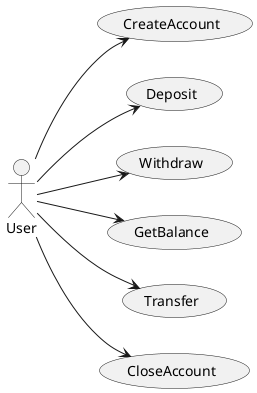
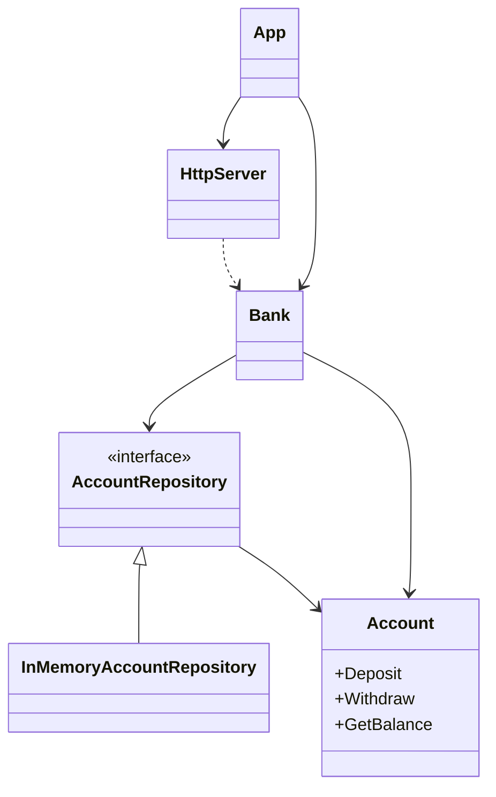

Bank app

## Description
This is a simple bank app that allows users to create accounts, deposit and withdraw money, and check their balance.
It can be accessed via HTTP API and follows Hexagonal Architecture.


### Use Cases


### Design



### API

- [POST /accounts](#create-account)
- [POST /accounts/:id/deposit](#deposit)
- [POST /accounts/:id/withdraw](#withdraw)
- [GET /accounts/:id](#get-balance)
- [POST /accounts/:id/transfer](#transfer)

#### Create Account
```
POST /accounts

Request: 
{
    "holder": "John Doe"
    "currency": "USD"
}

Response:
200 OK
```

#### Deposit
```
POST /accounts/{account_id}/deposit

Request:
{
    "amount": 100
    "currency": "USD"
}

Response:
200 OK
```

#### Withdraw
```
POST /accounts/{account_id}/withdraw

Request:
{
    "amount": 50
    "currency": "USD"
}

Response:
200 OK
```

#### Get Balance
```
GET /accounts/{account_id}

Response:
200 OK
{
    "balance": 50
    "currency": "USD"
}
```

#### Transfer
```
POST /accounts/1/transfer

Request:
{
    "to": "2",
    "amount": 50
}

Response:
200 OK
{
    "id": "1",
    "balance": 33
    "currency": "USD"
}
```


## Fun list

### use cases
- [x] create account
- [x] deposit money
- [x] withdraw money
- [x] get balance
- [ ] transfer money
- [ ] create user
- [ ] create a new user with a new account
- [ ] close account

### domain rules
- [x] Accounts have a currency
  - [x] prevent depositing money in a different currency
  - [x] prevent transferring money to a different currency account
- [ ] Users are the owners of accounts
  - [ ] Users can have multiple accounts
  - [ ] Accounts have an owner
- [ ] Users can have multiple accounts
- [ ] Removing users should close all accounts
- [ ] Loans
  - [ ] Users have a credit score [0-100%]
  - [ ] Initial credit score is 100
  - [ ] Users with balance > 0 can request a loan for up to 100% of their balance
  - [ ] Loans reduce the credit score by the percentage of the loan amount relative to the user's balance
    (ie: 500 loan on a 1000 balance reduces the credit score by 50%)
  - [ ] A user with a loan cannot close their last account

### infrastructure
- [ ] http api
  - [x] health check endpoint
  - [x] Users can create accounts
  - [x] Users can deposit money
  - [x] Users can withdraw money
  - [x] Users can get balance
  - [ ] Graceful shutdown bmwg2
  - [x] Users can transfer money between accounts
- [ ] Use a database to store accounts

### Refactorings
- [ ] handlers --> bmwg2