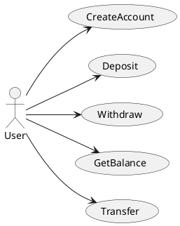
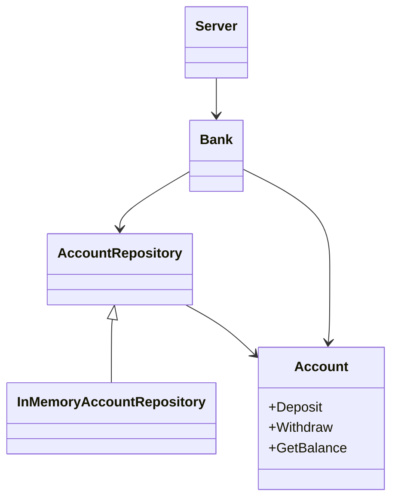

Bank app

## Description
This is a simple bank app that allows users to create accounts, deposit and withdraw money, and check their balance.

### Use Cases

```plantuml
@startuml

left to right direction

actor User

usecase CreateAccount
usecase Deposit
usecase Withdraw
usecase GetBalance
usecase Transfer

User --> CreateAccount
User --> Deposit
User --> Withdraw
User --> GetBalance
User --> Transfer

@enduml

```
### Design

```mermaid

classDiagram
    class Server
    class Bank
    interface AccountRepository
    class InMemoryAccountRepository
    class Account {
        +Deposit
        +Withdraw
        +GetBalance
    }
    
    
    Server --> Bank
    Bank --> AccountRepository
    AccountRepository <|-- InMemoryAccountRepository
    Bank --> Account
    AccountRepository --> Account
    


```